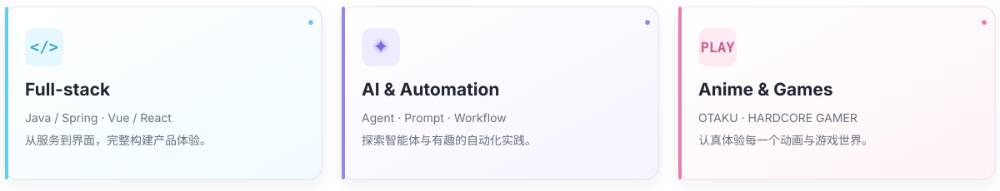

## `01` 关于我 / About

你好，我是 **YANHONG386**，目前从事全栈开发工作，关注工程质量与产品体验。

使用 **Java / Spring** 构建服务，也使用 **Vue / React** 完成前端体验；同时探索 **AI Agent、Prompt Engineering** 与自动化工作流。

`WORK` 全栈开发　·　`OTAKU` 重度二次元　·　`GAMING` 深度游戏玩家

## `02` 我的世界 / My World

## `03` 个人博客 / Blog

我的个人博客 **[yhong386.com](https://yhong386.com)**，记录全栈开发实践、AI 探索笔记，以及二次元与游戏生活。

## `04` 技术栈 / Stack

 

`BACKEND` Java · Spring · MyBatis　　`FRONTEND` Vue · React · JavaScript 
`DATA` MySQL · Redis · RabbitMQ　　`AI / OPS` Agent · Dify · Docker · Linux

## `05` 联系我 / Connect

---

**「在代码、动画与游戏之间，构建属于自己的世界。」**

